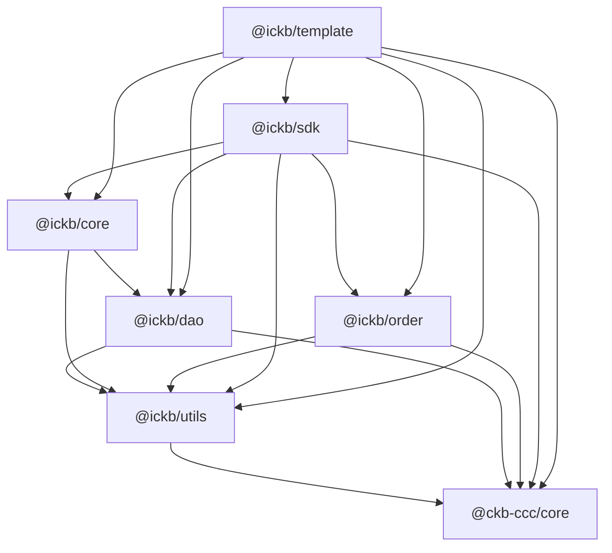

# iCKB/template

iCKB template built on top of CCC to manage iCKB Typescript libraries boilerplate.

Use `./sync.sh` to create or update boilerplate in repositories.

Note: `./sync.sh` doesn't clean up old boilerplate files.

## Dependencies

## Epoch Semantic Versioning

This repository follows [Epoch Semantic Versioning](https://antfu.me/posts/epoch-semver). In short ESV aims to provide a more nuanced and effective way to communicate software changes, allowing for better user understanding and smoother upgrades.

## Licensing

This source code, crafted with care by [Phroi](https://phroi.com/), is freely available on [GitHub](https://github.com/ickb/template) and it is released under the [MIT License](./LICENSE).
