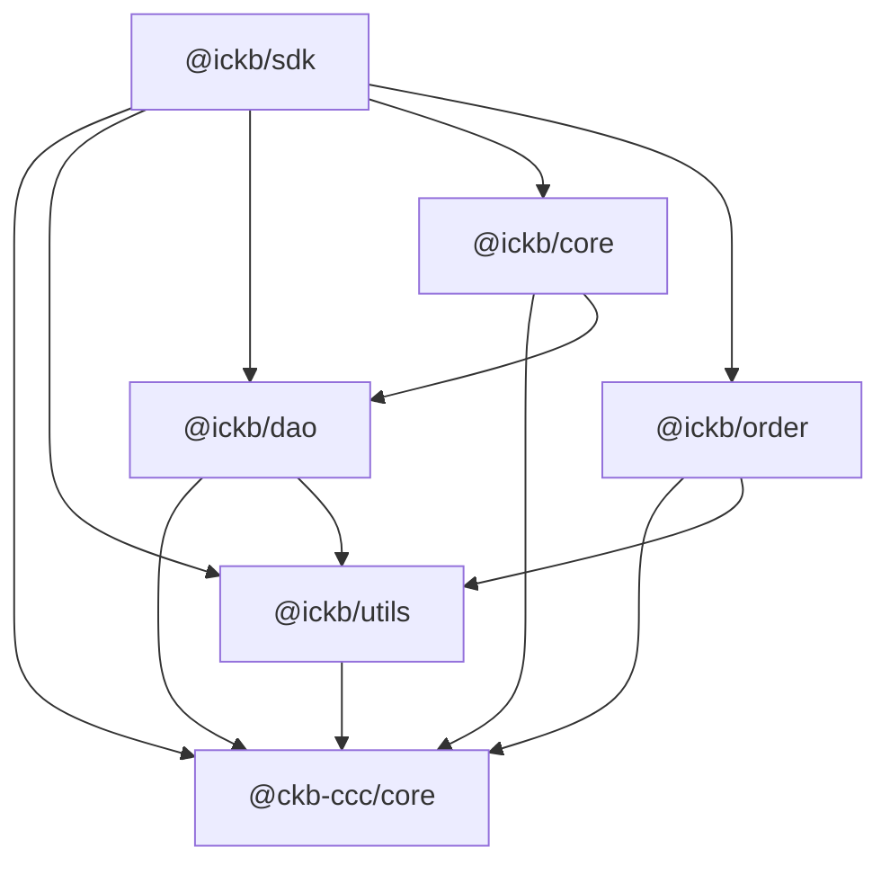

# iCKB Stack

iCKB Stack Monorepo: all TS libs, web UI, bot, CLI and shared packages, built on top of [CCC](https://github.com/ckb-devrel/ccc).

## Status

This monorepo is developing the **new generation** of iCKB libraries, replacing the deprecated `@ickb/lumos-utils` and `@ickb/v1-core` (which were built on the now-deprecated [Lumos](https://github.com/ckb-js/lumos) framework).

**New packages** (under `packages/`, built on CCC):

| Package | Purpose | Status |
|---|---|---|
| `@ickb/utils` | Blockchain primitives, transaction helpers, epoch arithmetic, UDT handling | Active development |
| `@ickb/dao` | Nervos DAO abstraction layer | Active development |
| `@ickb/order` | Limit order cell management | Active development |
| `@ickb/core` | iCKB core protocol logic (deposits, receipts, owned owner) | Active development |
| `@ickb/sdk` | High-level SDK composing all packages | Active development |

**Apps migration status:**

| App | Purpose | Stack |
|---|---|---|
| `apps/faucet` | Testnet CKB distribution | **Migrated** to new packages + CCC |
| `apps/sampler` | iCKB exchange rate sampling | **Migrated** to new packages + CCC |
| `apps/bot` | Automated order matching | Legacy (`@ickb/v1-core` + Lumos) |
| `apps/tester` | Order creation simulator | Legacy (`@ickb/v1-core` + Lumos) |
| `apps/interface` | React web UI | Legacy (`@ickb/v1-core` + Lumos) |

**Key upstream contributions:** UDT and Epoch support were contributed to CCC upstream and have been merged. Some local utilities may overlap with features now available natively in CCC.

## Dependencies



## Develop CCC

When `ccc-dev/pins/REFS` is committed, `pnpm install` automatically sets up the CCC local development environment on first run (by replaying pinned merges via `ccc-dev/replay.sh`). No manual setup step is needed — just clone and install:

```bash
git clone <repo-url> && cd stack && pnpm install
```

To redo the setup from scratch: `rm -rf ccc-dev/ccc && pnpm install`.

See [ccc-dev/README.md](ccc-dev/README.md) for recording new pins, developing CCC PRs, and the full workflow.

## Reference

Clone the on-chain contracts and whitepaper repos locally for AI context:

```bash
pnpm reference
```

This clones two repos into the project root (both are git-ignored and made read-only):

- **[contracts](https://github.com/ickb/contracts)** — Rust L1 scripts deployed on Nervos CKB
- **[whitepaper](https://github.com/ickb/whitepaper)** — iCKB protocol design and specification

## Developer Scripts

| Command | Description |
|---|---|
| `pnpm pr` | Open a GitHub PR creation page for the current branch. Uses Claude to auto-generate title and body when available, falls back to branch name and commit log. |
| `pnpm review` | Fetch and display PR review comments from GitHub for the current branch (or `pnpm review -- --pr <number>` for a specific PR). |

> **Note:** `gh` CLI is not available in this environment. Use `pnpm pr` and `pnpm review` instead.

## Epoch Semantic Versioning

This repository follows [Epoch Semantic Versioning](https://antfu.me/posts/epoch-semver). In short ESV aims to provide a more nuanced and effective way to communicate software changes, allowing for better user understanding and smoother upgrades.

## Licensing

This source code, crafted with care by [Phroi](https://phroi.com/), is freely available on [GitHub](https://github.com/ickb/stack/) and it is released under the [MIT License](./LICENSE).
