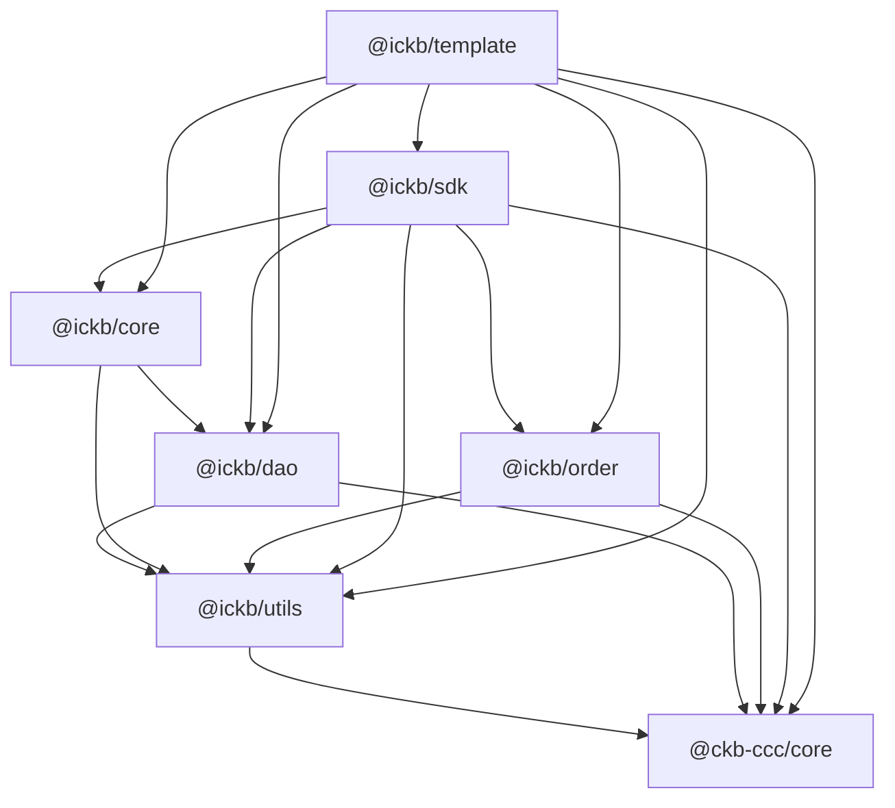

# iCKB/template

iCKB template built on top of CCC to manage iCKB Typescript libraries boilerplate.

## Sync boilerplate

Use `./sync.sh` to create or update boilerplate across repositories.

Note: it will not clean up old boilerplate files.

## Import locally

Import locally unpublished mono-repositories (like CCC) in case of working with a PR that is not yet published in canary.

```json
{
  "scripts": {
    "preinstall": "./.devcontainer/setup-local-store.sh https://github.com/ckb-devrel/ccc.git 9d016b7c0d349f16162e9387532448c81d879f87",
  },
  "dependencies": {
    "@ckb-ccc/core": "link:.local-store/ccc/packages/core",
    "@ckb-ccc/udt": "link:.local-store/ccc/packages/udt"
  }
}
```

## Distribute locally

Useful for testing changes across multiple repos before publishing to npm registry.

```json
{
    "prepare": "tsc && pnpm distribute",
    "distribute": "D=.local-store/$(jq -r .name < package.json); mkdir -p \"$D\" && rsync -a --delete --include='package.json' --include='src/***' --include='dist/***' --exclude='*' . \"$D\""
}
```

## Dependencies



## Epoch Semantic Versioning

This repository follows [Epoch Semantic Versioning](https://antfu.me/posts/epoch-semver). In short ESV aims to provide a more nuanced and effective way to communicate software changes, allowing for better user understanding and smoother upgrades.

## Licensing

This source code, crafted with care by [Phroi](https://phroi.com/), is freely available on [GitHub](https://github.com/ickb/template) and it is released under the [MIT License](./LICENSE).
