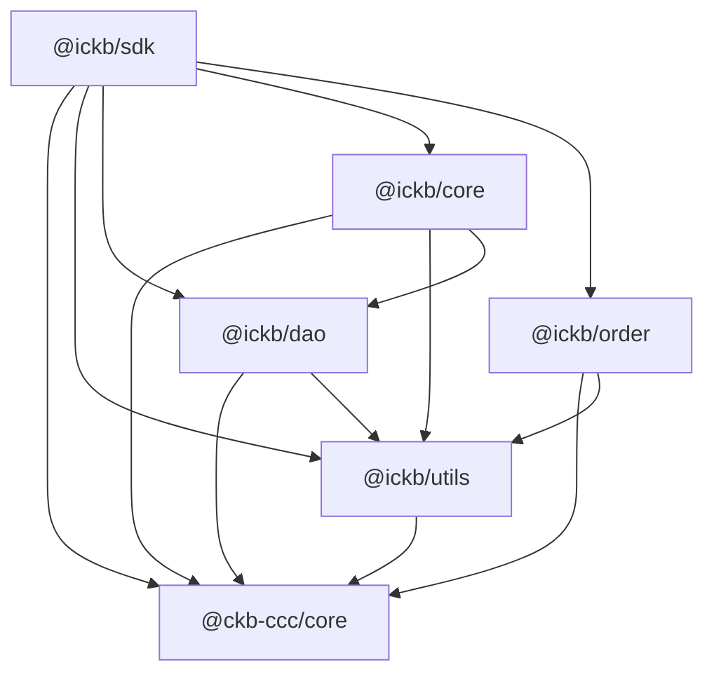

# iCKB Stack

iCKB Stack Monorepo: all TS libs, web UI, bot, CLI and shared packages, built on top of [CCC](https://github.com/ckb-devrel/ccc).

## Status

This monorepo is developing the **new generation** of iCKB libraries, replacing the deprecated `@ickb/lumos-utils` and `@ickb/v1-core` (which were built on the now-deprecated [Lumos](https://github.com/ckb-js/lumos) framework).

**New packages** (under `packages/`, built on CCC):

| Package       | Purpose                                                                    | Status             |
| ------------- | -------------------------------------------------------------------------- | ------------------ |
| `@ickb/utils` | Blockchain primitives, transaction helpers, epoch arithmetic, UDT handling | Active development |
| `@ickb/dao`   | Nervos DAO abstraction layer                                               | Active development |
| `@ickb/order` | Limit order cell management                                                | Active development |
| `@ickb/core`  | iCKB core protocol logic (deposits, receipts, owned owner)                 | Active development |
| `@ickb/sdk`   | High-level SDK composing all packages                                      | Active development |

**Apps migration status:**

| App              | Purpose                     | Stack                              |
| ---------------- | --------------------------- | ---------------------------------- |
| `apps/faucet`    | Testnet CKB distribution    | **Migrated** to new packages + CCC |
| `apps/sampler`   | iCKB exchange rate sampling | **Migrated** to new packages + CCC |
| `apps/bot`       | Automated order matching    | Legacy (`@ickb/v1-core` + Lumos)   |
| `apps/tester`    | Order creation simulator    | Legacy (`@ickb/v1-core` + Lumos)   |
| `apps/interface` | React web UI                | Legacy (`@ickb/v1-core` + Lumos)   |

**Key upstream contributions:** UDT and Epoch support were contributed to CCC upstream and have been merged. Some local utilities may overlap with features now available natively in CCC.

## Dependencies



## Develop with Forks

When `<name>-fork/pins/manifest` is committed, `pnpm install` automatically sets up the local fork development environment on first run (by replaying pinned merges via `fork-scripts/replay.sh`). No manual setup step is needed — just clone and install:

```bash
git clone git@github.com:ickb/stack.git && cd stack && pnpm install
```

To redo the setup from scratch: `pnpm fork:clean-all && pnpm install`.

See [ccc-fork/README.md](ccc-fork/README.md) for recording new pins, developing CCC PRs, and the full workflow.

## Reference

Clone the on-chain contracts and whitepaper repos locally for AI context:

```bash
pnpm reference
```

This clones two repos into the project root (both are git-ignored and made read-only):

- **[contracts](https://github.com/ickb/contracts)** — Rust L1 scripts deployed on Nervos CKB
- **[whitepaper](https://github.com/ickb/whitepaper)** — iCKB protocol design and specification

## Developer Scripts

| Command             | Description                                                                           |
| ------------------- | ------------------------------------------------------------------------------------- |
| `pnpm coworker`     | Launch an interactive AI Coworker session (full autonomy, opus model).                 |
| `pnpm coworker:ask` | One-shot AI query for scripting (sonnet model, stateless). Used by `pnpm ccc:record`. |
| `pnpm ccc:status`   | Check if CCC clone matches pinned state. Exit 0 = safe to wipe.                       |
| `pnpm ccc:record`   | Record CCC pins (clone, merge refs, build). Guarded against pending work.              |
| `pnpm ccc:save`     | Capture local CCC work as a patch in pins/ (survives re-records and replays).          |
| `pnpm ccc:push`     | Cherry-pick commits from wip branch onto a PR branch for pushing to the fork.          |
| `pnpm ccc:clean`    | Remove CCC clone, keep pins (guarded). Re-replay on next `pnpm install`.              |
| `pnpm ccc:reset`    | Remove CCC clone and pins (guarded). Restores published CCC packages.                 |
| `pnpm check:full`   | Wipe derived state and validate from scratch. Skips wipe if CCC has pending work.     |

## Epoch Semantic Versioning

This repository follows [Epoch Semantic Versioning](https://antfu.me/posts/epoch-semver). In short ESV aims to provide a more nuanced and effective way to communicate software changes, allowing for better user understanding and smoother upgrades.

## Licensing

This source code, crafted with care by [Phroi](https://phroi.com/), is freely available on [GitHub](https://github.com/ickb/stack/) and it is released under the [MIT License](./LICENSE).
