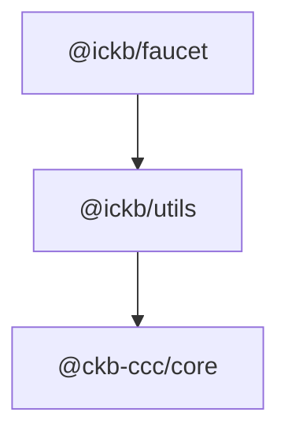

# iCKB/faucet

iCKB faucet an utility to help requesting faucet funds and convert them directly to iCKB.

## Dependencies



## Run the limit order fulfillment faucet on testnet

1. Download this repo in a folder of your choice:  

```bash
git clone https://github.com/ickb/faucet.git
```

2. Enter into the repo folder:

```bash
cd faucet
```

3. Install dependencies:

```bash
pnpm install
```

4. Build project:

```bash
pnpm build
```

5. Start the faucet utility:

```bash
export ADDRESS=ckt-your-testnet-address;
pnpm start;
```

Or

```bash
ADDRESS=ckt-your-testnet-address pnpm start;
```

## Licensing

This source code, crafted with care by [Phroi](https://phroi.com/), is freely available on [GitHub](https://github.com/ickb/faucet) and it is released under the [MIT License](./LICENSE).
