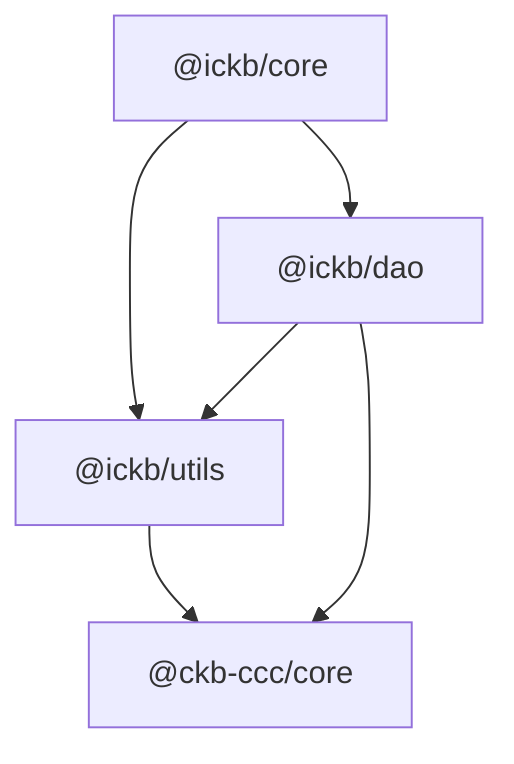

# iCKB/Core

iCKB Core utils built on top of CCC

## Dependencies

## Partial Transactions

`@ickb/core` transaction builders stop at protocol-specific construction.

If a caller will send the returned transaction, it still must:

1. Complete the transaction before send.
2. Prefer the shared stack path in `@ickb/sdk`: `sdk.completeTransaction(...)` or `completeIckbTransaction(...)`.
3. Only use lower-level manual completion when the caller intentionally owns UDT completion, CCC-native fee/capacity completion, and the DAO output-limit check itself.

## Epoch Semantic Versioning

This repository follows [Epoch Semantic Versioning](https://antfu.me/posts/epoch-semver). In short ESV aims to provide a more nuanced and effective way to communicate software changes, allowing for better user understanding and smoother upgrades.

## Licensing

This source code, crafted with care by [Phroi](https://phroi.com/), is freely available on [GitHub](https://github.com/ickb/stack/tree/master/packages/core) and it is released under the [MIT License](https://github.com/ickb/stack/tree/master/LICENSE).
