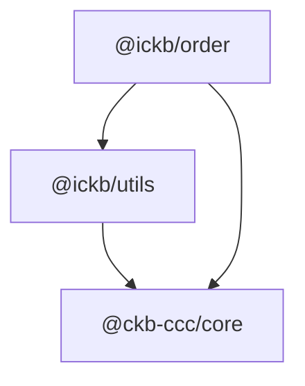

# iCKB/Order

UDT Limit Order utilities built on top of CCC.

## Dependencies

## Partial Transactions

`@ickb/order` transaction builders stop at order-specific construction.

If a caller will send the returned transaction, it still must:

1. Complete the transaction before send.
2. Prefer the shared stack path in `@ickb/sdk`: `sdk.completeTransaction(...)` or `completeIckbTransaction(...)`.
3. Only use lower-level manual completion when the caller intentionally owns UDT completion, CCC-native fee/capacity completion, and the DAO output-limit check itself.

## Limit Order Confusion Boundary

The deployed Limit Order script has a known confusion surface because CKB does not execute output locks at creation time. `@ickb/order` keeps the stack-side mitigation in `findOrders(...)`: it fetches the mint origin for each master, rejects candidates whose order script, UDT type, resolved master, or parameters differ from the origin, rejects candidates whose normalized value or directional progress is lower than the origin, then selects the best remaining candidate by progress/value. Ambiguous mint origins and ambiguous equal-score descendants are skipped instead of selected by indexer order. This is a best-effort stack-side heuristic for immutable deployed behavior, not proof that forged higher-progress descendants cannot exist. Consumers should use resolved `OrderGroup`s from `findOrders(...)` for matching and melting instead of hand-pairing order and master cells.

Minting does not execute the master output lock. If you call `OrderManager.mint(...)` with a raw `ccc.Script`, ensure it is a spendable whole-transaction-binding user lock; otherwise the order can be created but later become uncollectable.

## Epoch Semantic Versioning

This repository follows [Epoch Semantic Versioning](https://antfu.me/posts/epoch-semver). In short ESV aims to provide a more nuanced and effective way to communicate software changes, allowing for better user understanding and smoother upgrades.

## Licensing

This source code, crafted with care by [Phroi](https://phroi.com/), is freely available on [GitHub](https://github.com/ickb/stack/tree/master/packages/order) and it is released under the [MIT License](https://github.com/ickb/stack/tree/master/LICENSE).
