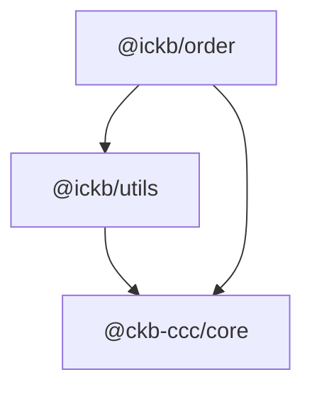

# iCKB/Order

UDT Limit Order utilities built on top of CCC.

## Dependencies

```mermaid
graph TD;
    A["@ickb/utils"] --> B["@ckb-ccc/core"];
    C["@ickb/order"] --> A;
    C --> B;

    click A "https://github.com/ickb/stack/tree/master/packages/utils" "Go to @ickb/utils"
    click B "https://github.com/ckb-devrel/ccc/tree/master/packages/core" "Go to @ckb-ccc/core"
    click C "https://github.com/ickb/stack/tree/master/packages/order" "Go to @ickb/order"
```

## Partial Transactions

`@ickb/order` transaction builders stop at order-specific construction.

If a caller will send the returned transaction, it still must:

1. Complete the transaction before send.
2. Prefer the shared stack path in `@ickb/sdk`: `sdk.completeTransaction(...)`.
3. Only use lower-level manual completion when the caller intentionally owns UDT completion, CCC-native fee/capacity completion, and the DAO output-limit check itself.

## Match Direction

Order directions are from the on-chain order owner's perspective. A `ckb-to-udt` order means the owner gives CKB and wants UDT, so the matcher spends UDT and receives CKB. A `udt-to-ckb` order means the owner gives UDT and wants CKB, so the matcher spends CKB and receives UDT.

`OrderManager.convert(...)` is the quote boundary. It computes the rounded-up output amount from the midpoint ratio and fee, then encodes `Info` so a full fill preserves that quote under the matcher integer arithmetic while fitting the order script's Uint64 ratio fields. If no Uint64 ratio can preserve the quote, conversion fails instead of silently weakening the order. Mint orders with the same amounts used for the successful quote.

Matching steps must be sized in the asset the matcher spends, not in the order owner's direction label. For an exchange rate like `1 BTC = 100000 USD`, a value step of `1000 USD` corresponds to `1000 USD` when the matcher spends USD, and `0.01 BTC` when the matcher spends BTC. Swapping those units either skips usable small matches or explodes the search into meaningless dust steps.

Candidate viability is netted across both directions. A CKB-to-UDT match can increase the matcher's CKB allowance for a UDT-to-CKB match in the same transaction, and a UDT-to-CKB match can increase UDT allowance for a CKB-to-UDT match. Below-step probes must account for those cross-side proceeds while still reserving CKB fees.

`bestMatch(...)` returns a discriminated result. `kind: "complete"` certifies that a conservative preflight fit the full atomic allowance domain inside `candidateBudget` and the search covered it. Otherwise `kind: "incomplete"` carries the best exactly evaluated match plus mode, budget, work, and truncation evidence. Incomplete matches are executable candidates, not proof of a global optimum. The deterministic bounded schedule probes each matcher's minimum, capped or full endpoint, configured step grid, and exact residual allowances without throwing on ordinary exhaustion.

`candidateBudget` owns all bounded search work. Directional frontier phases charge allowance probes before matcher execution and every prior-state inspection before partial-cap or duplicate filtering. One state-inspection unit includes any resulting frontier allocation and immediate economic evaluation; those effects are not charged again. The candidate phase charges the initial empty evaluation, every cross-frontier pair inspection before empty, partial-cap, or duplicate filtering, and every residual matcher attempt before duplicate filtering or matcher execution. A feasible cross candidate is evaluated within its pair-inspection unit rather than charged again. `diagnostics.candidates.total` is exactly the consumed candidate-phase subset of `diagnostics.workCount`; the remaining work belongs to the two directional frontier phases. Structural exits that start no inner traversal, including an effective partial cap below two, consume no pair-inspection work.

Per-partial profitability assumes the documented `sdk.completeTransaction(...)` path later adds and prepares a signer input after order inputs. The fee estimate therefore includes the empty witness-vector entry inserted for each preceding order partial, in addition to its serialized input, output, and data.

## Limit Order Confusion Boundary

The deployed Limit Order script has a known confusion surface because CKB does not execute output locks at creation time. `findOrders(...)` fetches the unique genuine mint order from the master-creation transaction and keeps it as an immutable baseline. A descendant is eligible only when its order script, UDT type, resolved master, and `Info` match that origin and neither its normalized total value nor directional progress is lower. A forged replacement therefore has to fund equal-or-better value before it can compete.

Eligible descendants are scored by progress first and total value second. Their out-point identity is irrelevant: a distinct better descendant wins, including one observed after an equal-score ambiguity. Equal-score non-mint candidates fail closed as ambiguous; when the genuine mint origin is still live, it wins an equal-score tie. This is a best-progress/value heuristic for immutable deployed behavior, not proof that a sufficiently funded forged descendant cannot exist.

Automatic matching accepts only validated `OrderGroup`s and carries each resolved group through the resulting `Match` into transaction construction. Use groups returned by `findOrders(...)`; raw `OrderCell`s are for parsing and inspection, not matching or melting.

Minting does not execute the master output lock. If you call `OrderManager.mint(...)` with a raw `ccc.Script`, ensure it is a spendable whole-transaction-binding user lock; otherwise the order can be created but later become uncollectable.

## Epoch Semantic Versioning

This repository follows [Epoch Semantic Versioning](https://antfu.me/posts/epoch-semver). In short ESV aims to provide a more nuanced and effective way to communicate software changes, allowing for better user understanding and smoother upgrades.

## Licensing

This source code, crafted with care by [Phroi](https://phroi.com/), is freely available on [GitHub](https://github.com/ickb/stack/tree/master/packages/order) and it is released under the [MIT License](https://github.com/ickb/stack/tree/master/LICENSE).
