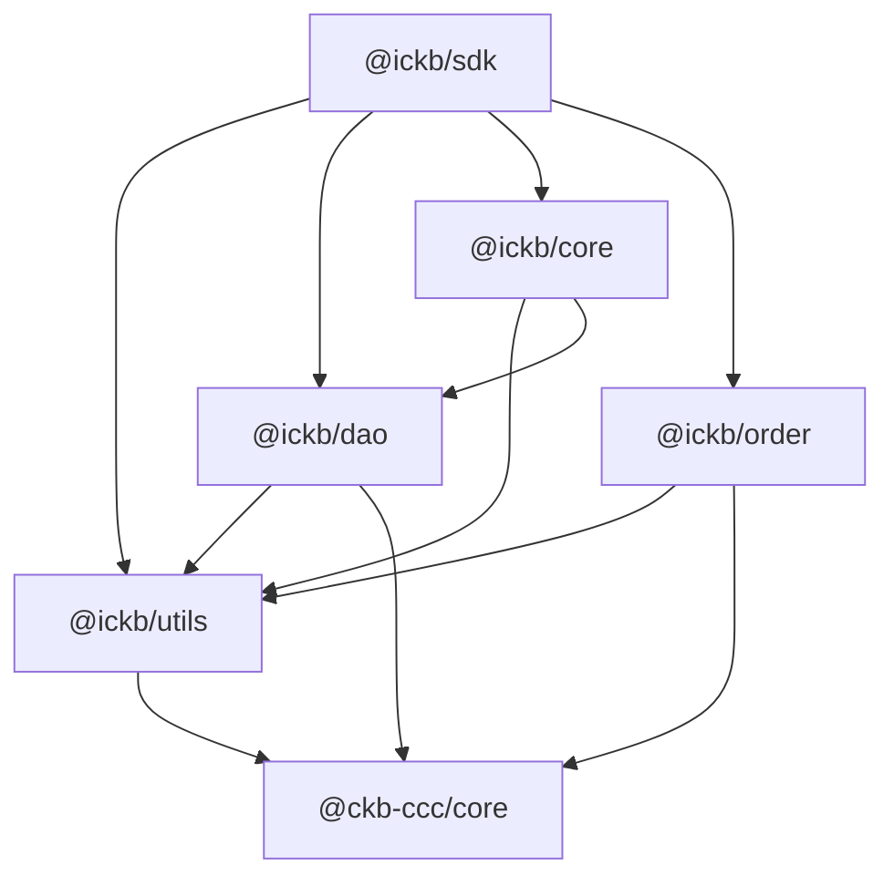

# iCKB/SDK

iCKB SDK built on top of CCC

## Dependencies

```mermaid
graph TD;
    A["@ickb/utils"] --> B["@ckb-ccc/core"];
    C["@ickb/dao"] --> A;
    C --> B;
    D["@ickb/core"] --> A;
    D --> C;
    E["@ickb/order"] --> A;
    E --> B;
    F["@ickb/sdk"] --> A;
    F --> C;
    F --> D;
    F --> E;

    click A "https://github.com/ickb/stack/tree/master/packages/utils" "Go to @ickb/utils"
    click B "https://github.com/ckb-devrel/ccc/tree/master/packages/core" "Go to @ckb-ccc/core"
    click C "https://github.com/ickb/stack/tree/master/packages/dao" "Go to @ickb/dao"
    click D "https://github.com/ickb/stack/tree/master/packages/core" "Go to @ickb/core"
    click E "https://github.com/ickb/stack/tree/master/packages/order" "Go to @ickb/order"
    click F "https://github.com/ickb/stack/tree/master/packages/sdk" "Go to @ickb/sdk"
```

## Pool Maturity Estimates

`@ickb/sdk` owns the stack-level summary that interface consumers use to estimate iCKB-to-CKB timing.

The current runtime path uses direct deposit scans together with bot liquidity and withdrawal-request state. The older pool snapshot idea is archived because its old format was not safely self-identifying.

See [docs/pool_maturity_estimates.md](./docs/pool_maturity_estimates.md).

## Ready Withdrawal Selection

`selectReadyWithdrawalDeposits(...)` exposes the stack's pool-friendly ready-deposit selector for direct iCKB-to-CKB withdrawal requests. Callers provide ready deposits, an optional near-ready refill window, the current tip, and amount/count limits. Setting `minCount` and `maxCount` to the same value requests an exact number of deposits. `preserveSingletons` defaults to `true`, so singleton bucket anchors are protected unless the caller explicitly permits selecting them. The selector prefers crowded-bucket extras before singleton anchors, returns the chosen deposits, and also returns `requiredLiveDeposits` for protected anchors that should be added as live `cell_dep` checks when building the withdrawal request.

`selectReadyWithdrawalCleanupDeposit(...)` is the narrow cleanup helper used by the bot for over-standard crowded-bucket extras. It returns at most one extra plus the protected anchor that must remain live. Bot thresholds such as target balances, singleton unlock policy, and whether a cleanup is worth doing remain app policy in `apps/bot`.

`IckbSdk.buildBaseTransaction(...)` accepts `withdrawalRequest.requiredLiveDeposits` and adds those cells as live cell deps. This is an inclusion-time liveness check for public pool anchors, not a reservation of those cells after the transaction commits.

## Conversion Transaction Builder

`IckbSdk.buildConversionTransaction(...)` builds a partial conversion transaction plus domain metadata. It owns the reusable CKB-to-iCKB and iCKB-to-CKB planning policy: base transaction assembly, direct deposit limits, exact ready-withdrawal selection, required live deposit anchors, order fallback construction, small iCKB dust order terms, and maturity metadata. The helper returns typed failures such as `amount-too-small`, `not-enough-ready-deposits`, and `nothing-to-do`; callers own user-facing copy.

For iCKB-to-CKB planning, `getPoolDeposits(client, tip, options?)` fetches the public pool deposit snapshot on chain and accepts an optional scan `limit`. The underlying DAO deposit scan requests one sentinel cell beyond that limit and fails closed if the sentinel appears. `getL1State(...)` includes that snapshot in `system.poolDeposits` so UI callers can key previews by the same pool identity and avoid re-fetching for every preview.

The returned transaction is not completed, signed, sent, or confirmed. Callers still explicitly call `sdk.completeTransaction(...)` with their signer/client/fee rate before sending.

## Small iCKB Order Previews

`IckbSdk.estimate(...)` returns order `info` even when the normal fee threshold is too small to produce a maturity estimate. Callers that intentionally build tiny iCKB-to-CKB orders can pass an explicit fee/feeBase discount to `estimate(...)`; the resulting order uses the existing order wire format. The limit-order contract can fully complete an order whose remaining match is below the configured minimum, so tiny dust orders do not need a special minimum-match encoding. This is how the interface presents small-balance conversions that may be worthwhile for recovering locked xUDT cell capacity.

## Send Confirmation

`sendAndWaitForCommit(...)` returns the transaction hash after commit. If a transaction was broadcast but later reaches a terminal non-committed status or times out while still pending, it throws `TransactionConfirmationError` with the broadcast `txHash`, last observed `status`, and `isTimeout` flag. Callers that need to log the hash immediately after broadcast can use the `onSent` callback.

## Epoch Semantic Versioning

This repository follows [Epoch Semantic Versioning](https://antfu.me/posts/epoch-semver). In short ESV aims to provide a more nuanced and effective way to communicate software changes, allowing for better user understanding and smoother upgrades.

## Licensing

This source code, crafted with care by [Phroi](https://phroi.com/), is freely available on [GitHub](https://github.com/ickb/stack/tree/master/packages/sdk) and it is released under the [MIT License](https://github.com/ickb/stack/tree/master/LICENSE).
