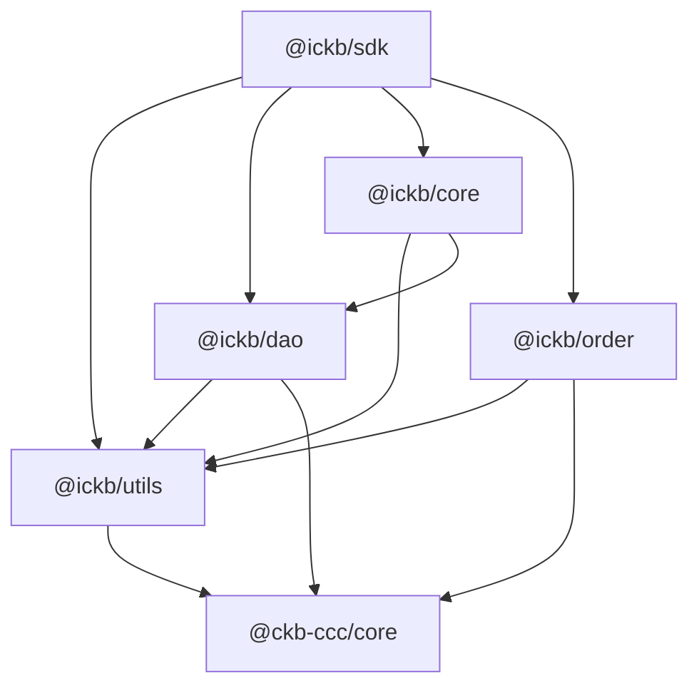

# iCKB/SDK

iCKB SDK built on top of CCC

## Dependencies

```mermaid
graph TD;
    A["@ickb/utils"] --> B["@ckb-ccc/core"];
    C["@ickb/dao"] --> A;
    C --> B;
    D["@ickb/core"] --> A;
    D --> C;
    E["@ickb/order"] --> A;
    E --> B;
    F["@ickb/sdk"] --> A;
    F --> C;
    F --> D;
    F --> E;

    click A "https://github.com/ickb/stack/tree/master/packages/utils" "Go to @ickb/utils"
    click B "https://github.com/ckb-devrel/ccc/tree/master/packages/core" "Go to @ckb-ccc/core"
    click C "https://github.com/ickb/stack/tree/master/packages/dao" "Go to @ickb/dao"
    click D "https://github.com/ickb/stack/tree/master/packages/core" "Go to @ickb/core"
    click E "https://github.com/ickb/stack/tree/master/packages/order" "Go to @ickb/order"
    click F "https://github.com/ickb/stack/tree/master/packages/sdk" "Go to @ickb/sdk"
```

## Pool Maturity Estimates

`@ickb/sdk` owns the stack-level summary that interface consumers use to estimate iCKB-to-CKB timing.

The current runtime path uses direct deposit scans together with bot liquidity and withdrawal-request state. Direct scans keep the estimate source unambiguous instead of trusting bot-owned no-type bytes that are not self-identifying.

See [docs/pool_maturity_estimates.md](./docs/pool_maturity_estimates.md).

## Ready Withdrawal Selection

`selectReadyWithdrawalDeposits(...)` exposes the stack's ready-deposit selector for direct iCKB-to-CKB withdrawal requests. Callers provide ready deposits, the current tip, amount/count limits, and optional ring filters. Setting `minCount` and `maxCount` to the same value requests an exact number of deposits. The selector compares bounded best-fit and greedy candidates, returns the chosen deposits, and also returns `requiredLiveDeposits` supplied by the caller for live `cell_dep` checks when building the withdrawal request.

Ring helpers such as `ringSurplusDepositFilter(...)` and `ringRequiredLiveDepositFor(...)` operate on the full live pool snapshot. Normal bot and interface direct withdrawals use ring surplus only; bot reserve recovery is app policy and may relax that rule after surplus recovery fails.

`IckbSdk.buildBaseTransaction(...)` accepts `withdrawalRequest.requiredLiveDeposits` and adds those cells as live cell deps. This is an inclusion-time liveness check for public pool anchors, not a reservation of those cells after the transaction commits.

## Conversion Transaction Builder

`IckbSdk.buildConversionTransaction(...)` builds a partial conversion transaction plus domain metadata. It owns the reusable CKB-to-iCKB and iCKB-to-CKB planning policy: base transaction assembly, direct deposit limits, exact ready-withdrawal selection, required live deposit anchors, order fallback construction, small iCKB dust order terms, and maturity metadata. The helper returns typed failures such as `amount-too-small`, `not-enough-ready-deposits`, and `nothing-to-do`; callers own user-facing copy.

For iCKB-to-CKB planning, `getPoolDeposits(client, tip, options?)` fetches the public pool deposit snapshot on chain. `getL1State(...)` includes that snapshot in `system.poolDeposits` so UI callers can key previews by the same pool identity and avoid re-fetching for every preview. `getPoolDeposits(...)`, `getL1State(...)`, and `getL1AccountState(...)` accept `cellPageSize` as the shared CCC cell-query page size; it does not cap total results. `getL1State(...)` also accepts `poolDeposits` range filters for callers that need a narrower pool window.

`getL1State(...)` and `getL1AccountState(...)` return best-effort state computed from a sampled `system.tip`; they do not perform a final current-tip assertion after all scans complete. Callers should keep the time from state fetch to transaction build low and let transaction validation decide whether referenced cells are still live and the transaction can be accepted.

The returned transaction is not completed, signed, sent, or confirmed. Callers still explicitly call `sdk.completeTransaction(...)` with their signer/client/fee rate before sending.

## Small iCKB Order Previews

`IckbSdk.estimate(...)` returns order `info` even when the normal fee threshold is too small to produce a maturity estimate. Callers that intentionally build tiny iCKB-to-CKB orders can pass an explicit fee/feeBase discount to `estimate(...)`; the resulting order uses the existing order wire format. The limit-order contract can fully complete an order whose remaining match is below the configured minimum, so tiny dust orders do not need a special minimum-match encoding. This is how the interface presents small-balance conversions that may be worthwhile for recovering locked xUDT cell capacity.

SDK estimates use `OrderManager.convert(...)` as the quote boundary. The displayed `convertedAmount` and returned order `info` are paired: the `info` preserves the rounded-up full-fill quote for the same amounts. If that quote cannot be represented in the order script's Uint64 ratio fields, SDK planners treat the order as too small or unbuildable rather than producing weaker terms.

## Send Confirmation

`sendAndWaitForCommit(...)` returns the transaction hash after commit. If a transaction was broadcast but later reaches a terminal non-committed status or times out while still pending, it throws `TransactionConfirmationError` with the broadcast `txHash`, last observed `status`, and `isTimeout` flag. Callers that need to log the hash immediately after broadcast can use the `onSent` callback. Callers that need structured lifecycle evidence can use `onLifecycle`, which emits `pre_broadcast_failed`, `broadcasted`, `committed`, `timeout_after_broadcast`, `post_broadcast_unresolved`, and `terminal_rejection` events without changing the returned hash or thrown transaction error contract.

## Epoch Semantic Versioning

This repository follows [Epoch Semantic Versioning](https://antfu.me/posts/epoch-semver). In short ESV aims to provide a more nuanced and effective way to communicate software changes, allowing for better user understanding and smoother upgrades.

## Licensing

This source code, crafted with care by [Phroi](https://phroi.com/), is freely available on [GitHub](https://github.com/ickb/stack/tree/master/packages/sdk) and it is released under the [MIT License](https://github.com/ickb/stack/tree/master/LICENSE).
