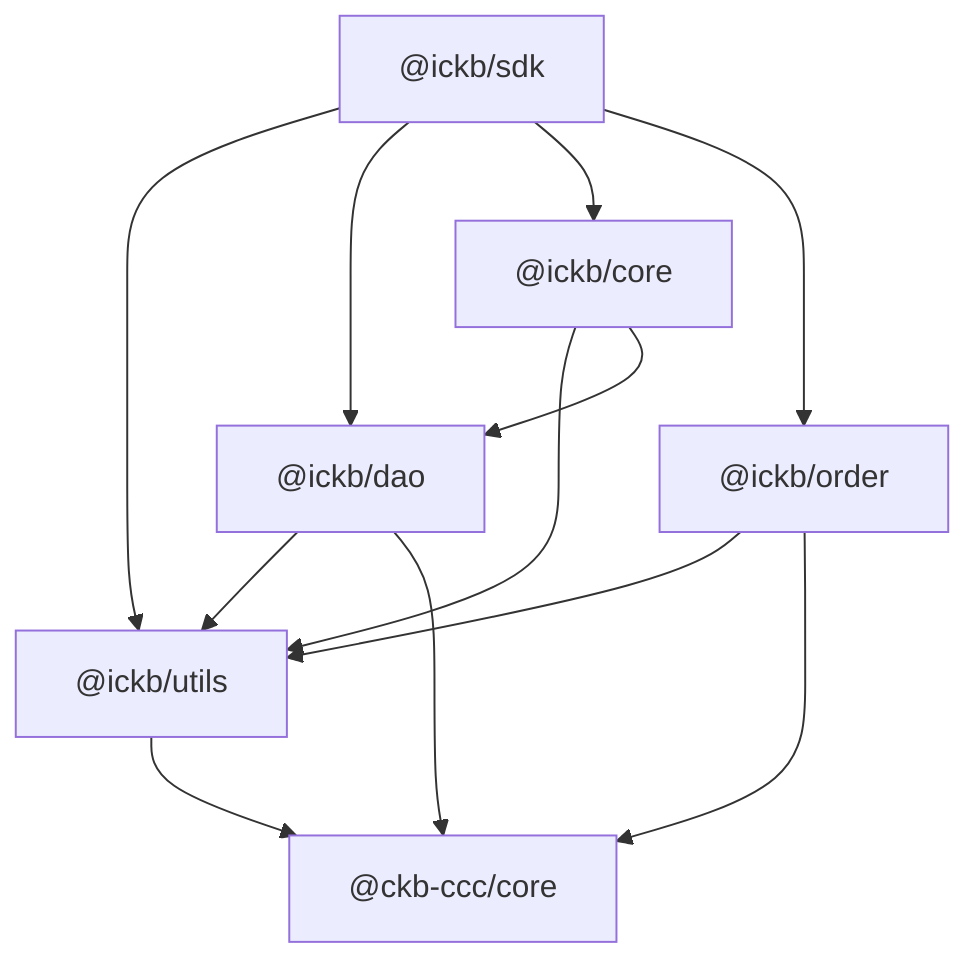

# iCKB/SDK

iCKB SDK built on top of CCC

## Dependencies

```mermaid
graph TD;
    A["@ickb/utils"] --> B["@ckb-ccc/core"];
    C["@ickb/dao"] --> A;
    C --> B;
    D["@ickb/core"] --> A;
    D --> C;
    E["@ickb/order"] --> A;
    E --> B;
    F["@ickb/sdk"] --> A;
    F --> C;
    F --> D;
    F --> E;

    click A "https://github.com/ickb/stack/tree/master/packages/utils" "Go to @ickb/utils"
    click B "https://github.com/ckb-devrel/ccc/tree/master/packages/core" "Go to @ckb-ccc/core"
    click C "https://github.com/ickb/stack/tree/master/packages/dao" "Go to @ickb/dao"
    click D "https://github.com/ickb/stack/tree/master/packages/core" "Go to @ickb/core"
    click E "https://github.com/ickb/stack/tree/master/packages/order" "Go to @ickb/order"
    click F "https://github.com/ickb/stack/tree/master/packages/sdk" "Go to @ickb/sdk"
```

## Pool Maturity Estimates

`@ickb/sdk` owns the stack-level summary that interface consumers use to estimate iCKB-to-CKB timing.

The current runtime path uses direct deposit scans together with bot liquidity and withdrawal-request state. Direct scans keep the estimate source unambiguous instead of trusting bot-owned no-type bytes that are not self-identifying.

See [docs/pool_maturity_estimates.md](./docs/pool_maturity_estimates.md).

## Ready Withdrawal Selection

`selectReadyWithdrawalDeposits(...)` exposes the stack's ready-deposit selector for direct iCKB-to-CKB withdrawal requests. Callers provide ready deposits, the current tip, an amount and count limit, and optional ring filters. The selector walks candidates greedily by maturity, taking each one that still fits, and returns the chosen deposits together with the `requiredLiveDeposits` supplied by the caller for live `cell_dep` checks. How many of them one transaction can carry is decided by completion: `completeFirstFundable(candidates, build, complete, accept?)` builds and completes candidates in order and returns the first the real completer funds and the caller accepts, advancing past capacity, DAO output-limit, and representability failures.

Ring helpers such as `ringSurplusDepositFilter(...)` and `ringRequiredLiveDepositFor(...)` operate on the full supplied live pool sample. Normal bot and interface direct withdrawals use ring surplus only; bot reserve recovery is app policy and may relax that rule after surplus recovery fails.

`IckbSdk.buildBaseTransaction(...)` accepts `withdrawalRequest.requiredLiveDeposits` and adds those cells as live cell deps. This is an inclusion-time liveness check for public pool anchors, not a reservation of those cells after the transaction commits.

## Conversion Transaction Builder

`IckbSdk.buildConversionTransaction(...)` builds and completes one conversion transaction plus domain metadata. It owns the reusable CKB-to-iCKB and iCKB-to-CKB planning policy: base transaction assembly, direct deposit counts, greedy ready-withdrawal candidates, required live deposit anchors, order fallback construction, small iCKB dust order terms, and maturity metadata. Candidate plans (deposit counts, or prefixes of the greedy withdrawal selection with their rebuilt remainder order) are completed in ranked order against the signer's committed cells and the first fundable one wins, so a wallet short of CKB degrades to fewer direct actions plus a larger standing order. The helper returns typed failures such as `amount-too-small` and `nothing-to-do`; callers own user-facing copy. When no plan can be funded, the last completion error throws.

For iCKB-to-CKB planning, `getPoolDeposits(client, tip, options?)` fetches the public pool deposits on chain. `getL1State(...)` includes that required scan result in `system.poolDeposits` so UI callers can key previews by the same pool identity without a second planning-time scan. `getPoolDeposits(...)`, `getL1State(...)`, and `getL1AccountState(...)` accept `cellPageSize` as the shared per-request CCC cell-query page size. Full pages must advance the indexer cursor. Every component scan of one read shares a single fixed budget of 6400 items and the pages that budget covers, so a read that would exceed it fails with `IckbError` code `account_scan_limit` instead of returning partial state. `getL1State(...)` also accepts `poolDeposits` range filters for callers that need a narrower pool window.

`getL1State(...)` and `getL1AccountState(...)` return eventually consistent, best-effort state computed from a sampled `system.tip`. Their targeted indexer queries can observe different points in indexer progress and are not an atomic snapshot. The SDK does not reread the scans or perform a final current-tip assertion. Callers should keep the time from state fetch to transaction build low and let transaction validation decide whether referenced cells are still live and the transaction can be accepted.

The returned transaction is completed but not signed, sent, or confirmed. `sdk.completeTransaction(...)` with `{ signer, feeRate }` remains available for transactions built from the lower-level managers.

## Small iCKB Order Previews

`IckbSdk.estimate(...)` returns order `info` even when the normal fee threshold is too small to produce a maturity estimate. Callers that intentionally build tiny iCKB-to-CKB orders can pass an explicit fee/feeBase discount to `estimate(...)`; the resulting order uses the existing order wire format. The limit-order contract can fully complete an order whose remaining match is below the configured minimum, so tiny dust orders do not need a special minimum-match encoding. This is how the interface presents small-balance conversions that may be worthwhile for recovering locked xUDT cell capacity.

SDK estimates use `OrderManager.convert(...)` as the quote boundary. The displayed `convertedAmount` and returned order `info` are paired: the `info` preserves the rounded-up full-fill quote for the same amounts. If that quote cannot be represented in the order script's Uint64 ratio fields, SDK planners treat the order as too small or unbuildable rather than producing weaker terms.

## Send Confirmation

`signAndSendTransaction(signer, tx, recordTxHash?)` signs locally, checks the signed fee rate against the CCC maximum that `sendTransactionNoCache` bypasses, and calls `recordTxHash` with `signed.hash()` before starting the send RPC. Before that fee check, it rejects a signer or connector that returns different ordered inputs, outputs, or outputs data than it was handed; witnesses, `cellDeps`, and `headerDeps` remain signer-owned, and the fee ceiling values inputs from the pre-sign transaction. That local hash is authoritative: a node that returns a different hash, or that reports a duplicate of a different transaction, fails closed with `TransactionBroadcastError`. A duplicate naming this exact transaction is an acceptance. Any other send failure is ambiguous and throws `TransactionBroadcastError` carrying `txHash`. The client cache is never marked.

`waitTransaction(client, txHash, { timeout?, interval?, signal? })` observes one already-broadcast transaction for a single bounded window and returns it once the node reports it committed. `timeout` defaults to 60000 ms, must be a non-negative safe integer no larger than one host timer delay, and is the absolute budget for the whole wait including in-flight client operations; `interval` defaults to 2000 ms. For `ClientJsonRpc`, it raw-polls `get_transaction` verbosity 1 so status-only rejections are preserved despite the current CCC cache issue. Every transaction body read uses `getTransactionNoCache`, also for non-JSON clients, and is normalized through `ccc.ClientTransactionResponse.from` so a generic client returning a malformed body is treated as unconfirmed rather than as commitment. Every Stack caller waits at depth zero for one window and then rebuilds from committed state; a consumer that needs depth would get it as an additive option. A terminal rejection throws `TransactionWaitError` with `txHash`, `status`, and the node `reason`; the next attempt rebuilds from exact committed cells, so nothing here clears or marks the client cache. Timeout uses CCC's `ErrorClientWaitTransactionTimeout`. CCC transports cannot be cancelled, so an in-flight operation may complete after the waiter rejects; its late settlement is handled. Callers own what follows a closed window: this helper never reopens one.

## Epoch Semantic Versioning

This repository follows [Epoch Semantic Versioning](https://antfu.me/posts/epoch-semver). In short ESV aims to provide a more nuanced and effective way to communicate software changes, allowing for better user understanding and smoother upgrades.

## Licensing

This source code, crafted with care by [Phroi](https://phroi.com/), is freely available on [GitHub](https://github.com/ickb/stack/tree/master/packages/sdk) and it is released under the [MIT License](https://github.com/ickb/stack/tree/master/LICENSE).
