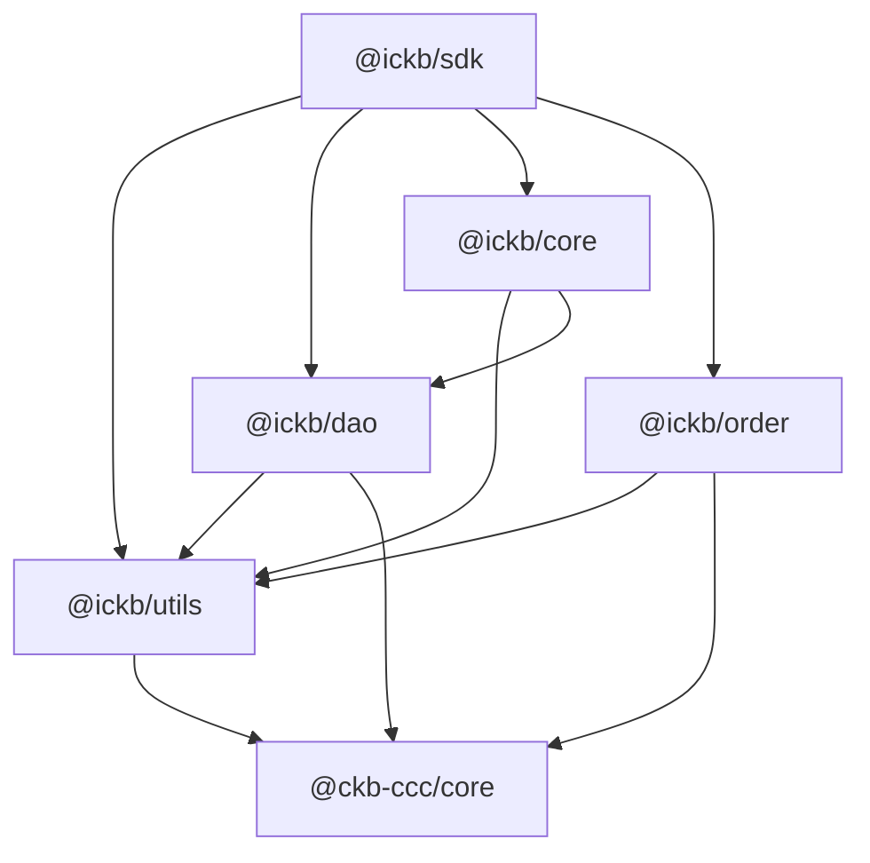

# iCKB/SDK

iCKB SDK built on top of CCC

## Dependencies

## Epoch Semantic Versioning

This repository follows [Epoch Semantic Versioning](https://antfu.me/posts/epoch-semver). In short ESV aims to provide a more nuanced and effective way to communicate software changes, allowing for better user understanding and smoother upgrades.

## Licensing

This source code, crafted with care by [Phroi](https://phroi.com/), is freely available on [GitHub](https://github.com/ickb/stack/tree/master/packages/sdk) and it is released under the [MIT License](https://github.com/ickb/stack/tree/master/LICENSE).
