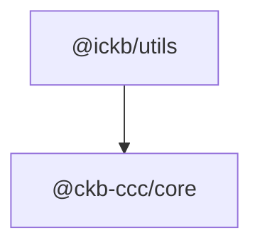

# iCKB/Utils

General utilities built on top of CCC

## Cell Pagination

`collectPagedScan(...)` owns cursor-based pagination for L1 cell scans. Its
`pageSize` is the size of each request, not a total cap. Empty and short pages
complete the scan; each full page must return a non-empty `lastCursor` that
differs from the cursor used for that request.

Total results are bounded by a `PagedScanBudget`. `defaultScanBudget(...)` builds
the fixed default from `defaultScanItemLimit` and the requested `pageSize`: the
pages that item ceiling spends, plus a fixed terminal-page allowance for the
short final page of each component scan. The allowance does not grow with the
number of component scans sharing it, so the collectors of one logical scan fail
together rather than returning partial state, and arbitrarily many empty
per-lock scans stay bounded.

## Dependencies

## Epoch Semantic Versioning

This repository follows [Epoch Semantic Versioning](https://antfu.me/posts/epoch-semver). In short ESV aims to provide a more nuanced and effective way to communicate software changes, allowing for better user understanding and smoother upgrades.

## Licensing

This source code, crafted with care by [Phroi](https://phroi.com/), is freely available on [GitHub](https://github.com/ickb/stack/tree/master/packages/utils) and it is released under the [MIT License](https://github.com/ickb/stack/tree/master/LICENSE).
